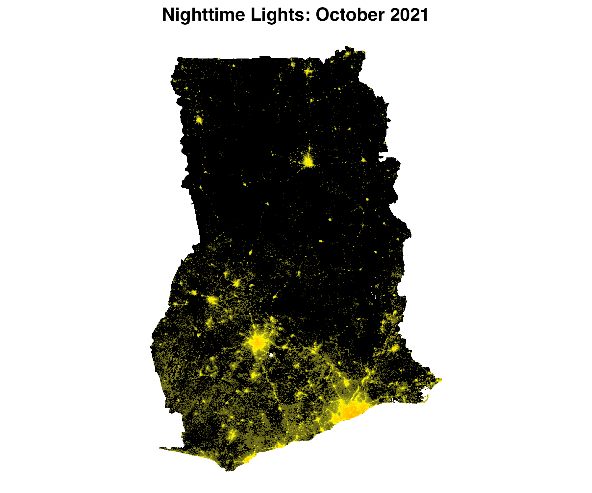

# blackmarbler 

Create Georeferenced Rasters of Nighttime Lights from [NASA Black Marble data](https://blackmarble.gsfc.nasa.gov/). **NOTE: This package is under active development and is subject to change**

* [Overview](#overview)
* [Installation](#installation)
* [Bearer token](#token)
* [Quick start](#quickstart)
  * [bm_raster() function](#function)
  * [Make raster](#raster)
  * [Make raster stack across multiple time periods](#stack)
  * [Make map](#map)
  * [Make figure of trends in nighttime lights](#trends)

## Overview <a name="overview"></a>

This package provides functions to download nighttime lights [Black Marble](https://blackmarble.gsfc.nasa.gov/) data. Black Marble data is downloaded from the [NASA LAADS Archive](https://ladsweb.modaps.eosdis.nasa.gov/archive/allData/5000/VNP46A3/). However, downloading data for specific regions for a long time period from the NASA LAADS Archive can be time consuming. This package automates the process of (1) downloading data from the NASA LAADS Archive, (2) converting files from H5 files to geotiff files, and (3) mosiacing files together (when needed).

## Installation <a name="installation">

Eventually the package will be available via `devtools`; for now, load the packages using the below code.

```r
INSTALL_PACKAGES <- F

if(INSTALL_PACKAGES){}
  install.packages("purrr")
  install.packages("furrr")
  install.packages("stringr")
  install.packages("raster")
  install.packages("dplyr")
  install.packages("sf")
  install.packages("lubridate")
  install.packages("BiocManager")
  BiocManager::install("rhdf5")
}

source("https://raw.githubusercontent.com/ramarty/download_blackmarble/main/R/download_blackmarble.R")
```

## Bearer Token <a name="token">

The function requires using a **Bearer Token**; to obtain a token, follow the below steps:

1. Go to the [NASA LAADS Archive](https://ladsweb.modaps.eosdis.nasa.gov/archive/allData/5000/VNP46A3/)
2. Click "Login" (bottom on top right); create an account if needed.
3. Click "See wget Download Command" (bottom near top, in the middle)
4. After clicking, you will see text that can be used to download data. The "Bearer" token will be a long string in red.

## Quickstart <a name="quickstart">

### bm_raster() Function <a name="function">

The primary function in the package is `bm_raster`, which produces a raster of black marble nighttime lights. It can produce rasters from the following Black Marble products:

* `VNP46A1`: Daily nighttime lights
* `VNP46A2`: Daily nighttime lights with additional light corrections.
* `VNP46A3`: Monthly nighttime lights.
* `VNP46A4`: Annual nighttime lights.

For more infromation on the different nighttime lights products, see [here](https://blackmarble.gsfc.nasa.gov/#product).

The function takes the following arguments:
 
* `roi_sf`: Region of interest; sf polygon. Must be in the [WGS 84 (epsg:4326)](https://epsg.io/4326) coordinate reference system.
* `product_id`: Either: `VNP46A1`, `VNP46A2`, `VNP46A3`, or `VNP46A4`. 
* `date`: Date of raster data. For `VNP46A1` and `VNP46A2` (daily data), a date (eg, `"2021-10-03"`). For `VNP46A3` (monthly data), a date or year-month (e.g., (a) `"2021-10-01"`, where the day will be ignored, or (b) `"2021-10"`). For `VNP46A4` (annual data), year or date  (e.g., (a) `"2021-10-01"`, where the month and day will be ignored, or (b) `"2021"`). Entering one date will produce a raster. Entering multiple dates will produce a raster stack.
* `bearer`: NASA bearer token. 
* `variable`: Variable to used to create raster (default: `NULL`). If `NULL`, uses a a default variable. For `VNP46A1`, uses `DNB_At_Sensor_Radiance_500m`. For `VNP46A2`, uses `Gap_Filled_DNB_BRDF-Corrected_NTL`. For `VNP46A3` and `VNP46A4`, uses `NearNadir_Composite_Snow_Free`. For information on other variable choices, see [here](https://ladsweb.modaps.eosdis.nasa.gov/api/v2/content/archives/Document%20Archive/Science%20Data%20Product%20Documentation/VIIRS_Black_Marble_UG_v1.2_April_2021.pdf); for `VNP46A1`, see Table 3; for `VNP46A2` see Table 6; for `VNP46A3` and `VNP46A4`, see Table 9.

### Make raster of nighttime lights <a name="raster">

The below example shows making daily, monthly, and annual rasters of nighttime
lights for Ghana.

```r
#### Setup
# Define NASA bearer token
bearer <- "BEARER-TOKEN-HERE"

# Define region of interest (roi). The roi must be (1) an sf polygon and (2)
# in the WGS84 (epsg:4326) coordinate reference system. Here, we use the 
# getData function to load a polygon of Ghana
roi_sf <- getData('GADM', country='GHA', level=0) %>% st_as_sf()

#### Make Rasters
### Daily data: raster for February 5, 2021
r_20210205 <- bm_raster(roi_sf = roi_sf,
                        product_id = "VNP46A2",
                        date = "2021-02-05",
                        bearer = bearer)
  
### Monthly data: raster for October 2021
r_202110 <- bm_raster(roi_sf = roi_sf,
                      product_id = "VNP46A3",
                      date = "2021-10-01", # The day is ignored
                      bearer = bearer)

### Annual data: raster for 2021
r_2021 <- bm_raster(roi_sf = roi_sf,
                    product_id = "VNP46A4",
                    date = 2021,
                    bearer = bearer)
```

### Make raster stack of nighttime lights across multiple time periods <a name="stack">

To extract data for multiple time periods, add multiple time periods to `date`. The function will return a raster stack, where each raster band corresponds to a different date. The below code provides examples getting data across multiple days, months, and years.

```r
#### Daily data in March 2021
r_daily <- bm_raster(roi_sf = roi_sf,
                     product_id = "VNP46A3",
                     date = seq.Date(from = ymd("2021-03-01"), to = ymd("2021-03-31"), by = "day"),
                     bearer = bearer)
                          
#### Monthly aggregated data in 2021 and 2022
r_monthly <- bm_raster(roi_sf = roi_sf,
                       product_id = "VNP46A3",
                       date = seq.Date(from = ymd("2021-01-01"), to = ymd("2022-12-01"), by = "month"),
                       bearer = bearer)
                          
#### Yearly aggregated data in 2012 and 2021
r_annual <- bm_raster(roi_sf = roi_sf,
                      product_id = "VNP46A4",
                      date = 2012:2021,
                      bearer = bearer)
```

### Map of nighttime lights <a name="map">

Using one of the rasters, we can make a map of nighttime lights

```r
#### Packages
# Need ggplot for mapping
library(ggplot2)

#### Prep data
r_2021 <- r_2021 %>% mask(roi_sf) 

r_df <- rasterToPoints(r_2021, spatial = TRUE) %>% as.data.frame()
names(r_df) <- c("value", "x", "y")

## Remove very low values of NTL; can be considered noise 
r_df$value[r_df$value <= 2] <- 0

## Distribution is skewed, so log
r_df$value_adj <- log(r_df$value+1)

##### Map 
p <- ggplot() +
  geom_raster(data = r_df, 
              aes(x = x, y = y, 
                  fill = value_adj)) +
  scale_fill_gradient2(low = "black",
                       mid = "yellow",
                       high = "red",
                       midpoint = 4.5) +
  labs(title = "NTL, October 2021") +
  coord_quickmap() + 
  theme_void() +
  theme(plot.title = element_text(face = "bold", hjust = 0.5),
        legend.position = "none")
```

<p align="center">

</p>

### Trends over time <a name="trends">

We can use multiple rasters over time to observe changes in nighttime lights over time. The below code leverages the [`exactextractr`](https://github.com/isciences/exactextractr) package to summarize annual nighttime lights to Ghana's first administrative division.

```r
#### Packages
# Rely on exactextractr to summarize nighttime lights within admin zones and ggplot for the figure.
library(exactextractr)
library(ggplot2)

#### Polygons on Ghana
# Load both country and admin 1 level. Country-level is needed as bm_raster() requires
# a polygon that is just one row.
gha_0_sf <- getData('GADM', country='GHA', level=0) %>% st_as_sf()
gha_1_sf <- getData('GADM', country='GHA', level=1) %>% st_as_sf()

#### Extract annual data
r <- bm_raster(roi_sf = gha_0_sf,
               product_id = "VNP46A4",
               date = 2012:2022,
               bearer = bearer)

ntl_df <- exact_extract(r, gha_1_sf, 'mean', progress = FALSE)
ntl_df$NAME_1 <- gha_1_sf$NAME_1

#### Trends over time
ntl_df %>%
  pivot_longer(cols = -NAME_1) %>%
  mutate(year = name %>% str_replace_all("mean.t", "") %>% as.numeric()) %>%
  ggplot() +
  geom_col(aes(x = year,
               y = value),
           fill = "darkorange") +
  facet_wrap(~NAME_1) +
  labs(x = NULL,
       y = "NTL Luminosity",
       title = "Ghana Admin Level 1: Annual Average Nighttime Lights") +
  theme_minimal() +
  theme(strip.text = element_text(face = "bold")) 
```

<p align="center">

</p>

